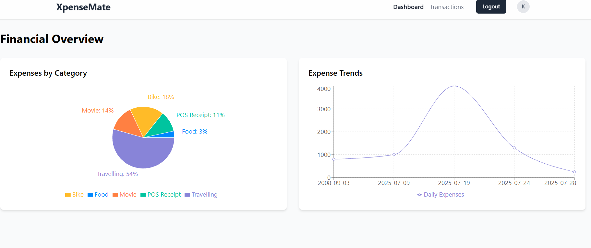
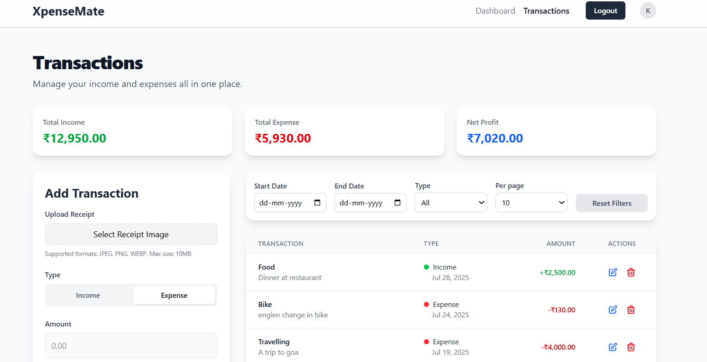

<div align="center">

# XpenseMate📈

Track spending, manage budgets, and reach your financial goals effortlessly.

</div>

---

## Table of Contents

1. [About the Project](#about-the-project)
2. [Project Screenshots](#project-screenshots)
3. [Demo Video](#demo-video)
4. [Built With](#built-with)
5. [Features](#features)
6. [Getting Started](#getting-started)
    - [Prerequisites](#prerequisites)
    - [Installation](#installation)
    - [Running the Backend](#running-the-backend)
    - [Running the Frontend](#running-the-frontend)
7. [Project Structure](#project-structure)
8. [License](#license)

---

## About the Project

**XpenseMate** is a full-stack web application designed to simplify personal finance management. Users can register, log in, add and categorize transactions, upload receipts for automatic data extraction, and visualize their spending trends and breakdowns. The app is built with a focus on usability, security, and insightful analytics.

<div align="center">
  
 
  
</div>

---

## Project Screenshots

<div align="center">
  
  
</div>

<p align="center">
  <b>Dashboard</b> &nbsp; &nbsp; &nbsp; <b>Transactions</b>
</p>

---

## Demo Video

Experience XpenseMate in action with this quick walkthrough:

> _Watch the demo video below (if viewing locally, open the video file in the public folder):_

<video src="client/public/XpenseMate.mp4" controls width="500"></video>

---

## Built With

XpenseMate is powered by a modern tech stack:

-  : Dynamic user interfaces.
-  : Efficient server-side scripting.
-  : Streamlined API development.
-  : User profile and authentication.
-  : Lightning-fast frontend tooling.
-  : Utility-first CSS framework.
-  : Secure authentication.
-  : OCR for receipt scanning.

---

## Features

- **User Authentication:** Secure registration and login with JWT.
- **Transaction Management:** Add, delete, and filter transactions.
- **Receipt Scanning:** Upload receipts (JPEG, PNG, WEBP) and extract transaction data using OCR.
- **Dashboard:** Visualize expenses by category and over time with interactive charts.
- **Pagination & Filtering:** Easily browse and filter your transaction history.
- **Responsive UI:** Clean, modern, and mobile-friendly interface.
- **Protected Routes:** Only authenticated users can access sensitive pages.
- **Context-based State Management:** Seamless user experience across the app.

---


## Getting Started

### Prerequisites

- **Node.js** (v16+ recommended)
- **npm** (v8+ recommended)
- **MongoDB** (local or cloud instance)

### Installation

#### 1. Clone the repository

```bash
git clone https://github.com/yourusername/XpenseMate.git
cd XpenseMate
```

#### 2. Backend Setup

```bash
cd server
npm install
```

- Create a `.env` file in the `server` directory with the following:

  ```
  MONGODB_URI=your_mongodb_connection_string
  JWT_SECRET=your_jwt_secret
  PORT=5000
  ```

#### 3. Frontend Setup

```bash
cd ../client
npm install
```

---

### Running the Backend

```bash
cd server
npm run dev
```

- The backend will start on [http://localhost:5000](http://localhost:5000) by default.

### Running the Frontend

```bash
cd client
npm run dev
```

- The frontend will start on [http://localhost:5173](http://localhost:5173) by default.

---

## Project Structure

```
XpenseMate/
├── server/                # Backend (Node.js/Express)
│   ├── config/            # Database config
│   ├── controllers/       # Route controllers
│   ├── middlewares/       # Express middlewares
│   ├── models/            # Mongoose models
│   ├── routes/            # API routes
│   ├── services/          # Business logic services
│   ├── utils/             # Utility functions (e.g., receipt parsing)
│   ├── server.js          # Entry point
│   └── package.json
├── client/                # Frontend (React/Vite)
│   ├── public/            # Static assets
│   ├── src/
│   │   ├── api/           # API interaction logic
│   │   ├── component/     # Reusable UI components
│   │   ├── context/       # React context providers
│   │   ├── pages/         # Main page components
│   │   ├── utils/         # Utility functions
│   │   ├── App.jsx        # App root
│   │   └── main.jsx       # Entry point
│   ├── README.md          # Client-specific documentation
│   ├── package.json
│   └── vite.config.js


```
